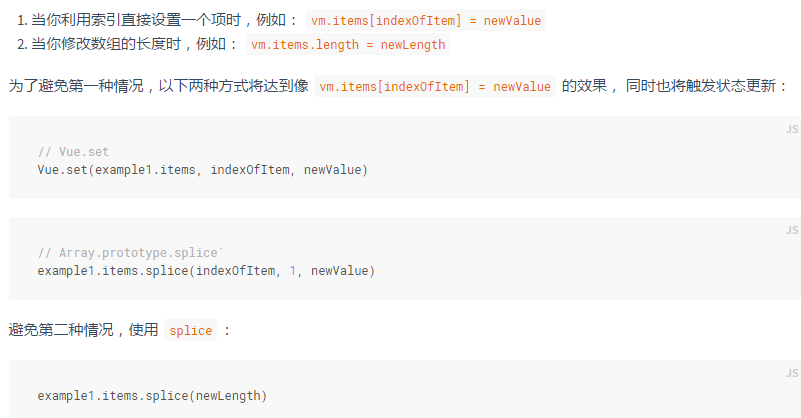

## VUE学习笔记

[TodoList](https://alanzhang001.github.io/vuelearning/todolist/sites/index.html)

### 笔记
##### 1. Vue.js 支持所有兼容 ECMAScript 5 的浏览器，不支持IE8;
##### 2. Vue 实例暴露了一些有用的实例属性与方法。这些属性与方法都有前缀 $;
```
var data = { a: 1 }
var vm = new Vue({
  el: '#example',
  data: data
})
vm.$data === data // -> true
vm.$el === document.getElementById('example') // -> true
```
##### 3. Vue 的生命周期图见<http://cn.vuejs.org/v2/guide/instance.html#生命周期图示>
##### 4. 所有的 Vue.js 组件其实都是被扩展的 Vue构造函数的 实例
```
var MyComponent = Vue.extend({
  // 扩展选项
})
// 所有的 `MyComponent` 实例都将以预定义的扩展选项被创建
var myComponentInstance = new MyComponent()
```
##### 5. 表达式插值

- Mustache`{{}}` 不能在 HTML 属性中使用，应使用 v-bind 指令
- `{{}}`每个绑定都只能包含单个表达式，就是执行后必须得到一个值，`return,var `等是无法正确解析的
- 模板表达式放置在沙盒中，只能访问全局变量的一个白名单列表，如 Math 和 Date。在模板表达式中，你不应该试图访问用户定义的全局变量。

##### 6. 使用 key 控制元素的可重用

##### 7. 由于 JavaScript 的限制， Vue 不能检测以下变动的数组

##### 8. model语法

##### 9. 在属性是布尔类型的一些情况中，v-bind 的作用有点不同，只要值存在就会隐含为 true

##### 10. 关于component
- data 必须是一个函数
##### 11. 为什么监听器会放在 HTML 中？
- 通过浏览 HTML 模板，就能很方便地找到在 JavaScript 代码里对应的处理函数。
- 由于无须在 JavaScript 里手动绑定事件，你的 ViewModel 代码可以是非常纯粹的逻辑，并且和 DOM 完全解耦，更易于测试。
- 当一个 ViewModel 被销毁时，所有的事件监听器都会被自动删除。你无须担心如何自己清理它们。
##### 12. 表单绑定
- 对于需要使用输入法的语言（中文、日文、韩文等），你会发现，在输入法字母组合窗口输入时，v-model 并不会触发数据更新。如果想在此输入过程中，满足更新数据的需求，需要使用 input 事件。

##### 13. v-if vs v-show

- v-if 是“真实”的条件渲染,因为它会确保条件块在切换的过程中，完整地销毁和重新创建条件块内的事件监听器和子组件
- 管初始条件如何，元素始终渲染，并且只是基于 CSS 的切换。
- 如果需要频繁切换，推荐使用 v-show，如果条件在运行时改变的可能性较少，推荐使用 v-if。
- v-show 无法用于 <template> 元素，也不能和 v-else 配合使用

### 其他常见问题
- [解说vue开发过程中的“深坑”](https://zhuanlan.zhihu.com/p/39398459)
    + v-for key的问题


### 常见配置内容
- [路由懒加载](https://router.vuejs.org/zh/guide/advanced/lazy-loading.html#%E6%8A%8A%E7%BB%84%E4%BB%B6%E6%8C%89%E7%BB%84%E5%88%86%E5%9D%97)
- [vue 设置eslint](https://vue-loader-v14.vuejs.org/zh-cn/workflow/linting.html)

### 学习资料
- <http://cn.vuejs.org/>
- 尤雨溪:Vue 2.0 的建议学习顺序:<https://zhuanlan.zhihu.com/p/23134551>
- <http://todomvc.com/>
- Vue.js资源:<https://segmentfault.com/a/1190000008378497>
