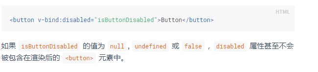

## VUE学习笔记

### 当前进度：<https://cn.vuejs.org/v2/guide/components.html>

### 笔记
##### 1. Vue.js 支持所有兼容 ECMAScript 5 的浏览器，不支持IE8;
##### 2. Vue 实例暴露了一些有用的实例属性与方法。这些属性与方法都有前缀 $;
```
var data = { a: 1 }
var vm = new Vue({
  el: '#example',
  data: data
})
vm.$data === data // -> true
vm.$el === document.getElementById('example') // -> true
```
##### 3. Vue 的生命周期图见<http://cn.vuejs.org/v2/guide/instance.html#生命周期图示>
##### 4. 所有的 Vue.js 组件其实都是被扩展的 Vue构造函数的 实例
```
var MyComponent = Vue.extend({
  // 扩展选项
})
// 所有的 `MyComponent` 实例都将以预定义的扩展选项被创建
var myComponentInstance = new MyComponent()
```
##### 5. Mustache`{{}}` 不能在 HTML 属性中使用，应使用 v-bind 指令
##### 6. 使用 key 控制元素的可重用

##### 7. 由于 JavaScript 的限制， Vue 不能检测以下变动的数组

##### 8. model语法

##### 9. 在属性是布尔类型的一些情况中，v-bind 的作用有点不同，只要值存在就会隐含为 true

##### 10 关于component
- data 必须是一个函数

### 其他常见问题
- [解说vue开发过程中的“深坑”](https://zhuanlan.zhihu.com/p/39398459)
    + v-for key的问题

### 我的学习路线
1. 通读基础部分，实现其中提到的例子【除组件外已完成】
2. 完成TODOLIST【完成】[TodoList](https://alanzhang001.github.io/vuelearning/todolist/sites/index.html)
3. 阅读阅读官方教程进阶篇的前半部分【未完成】
4. **根据个人学习情况调整，实时阅读vue做的学习顺序建议**

### 学习资料
- <http://cn.vuejs.org/>
- 尤雨溪:Vue 2.0 的建议学习顺序:<https://zhuanlan.zhihu.com/p/23134551>
- <http://todomvc.com/>
- Vue.js资源:<https://segmentfault.com/a/1190000008378497>